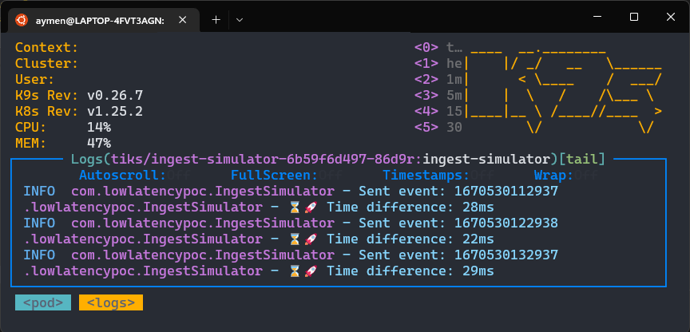
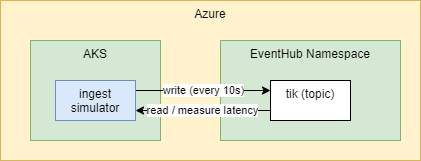

# azure-low-latency-poc
A demo application that measures the round trip time of an event being written to and from an event hub topic running on Azure. 

This project is for deploying an Azure Kubernetes Service (AKS) cluster and an Azure Event Hub. The AKS cluster will be used for deploying and managing containerized applications, while the Event Hub will be used for data streaming and ingestion. The project includes a Terraform configuration for provisioning the AKS cluster and Event Hub, as well as a Terraform variable file for defining customizable parameters. Additionally, a Terraform test file is included for validating the deployment. 

## Demo Application
To build and deploy the application, follow the steps below:
1. cd ingest-simulator
2. mvn package
3. docker build -t crtiksdevcontainerregistry.azurecr.io/ingest-simulator:latest .
4. docker push crtiksdevcontainerregistry.azurecr.io/ingest-simulator:latest
5. kubectl apply -f kubernetes/deployment.yaml

## Local Infrastructure Setup
To use this infrastructure project, follow the steps below:

1. Create a terraform.tfvars file and define the required input variables. A sample terraform.tfvars.example file is provided for reference.
2. Run terraform plan to see the infrastructure that will be created.
3. Run terraform apply to create the infrastructure.